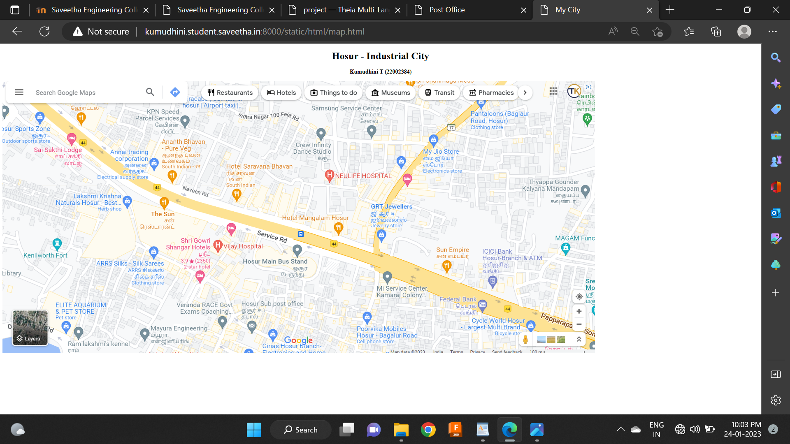
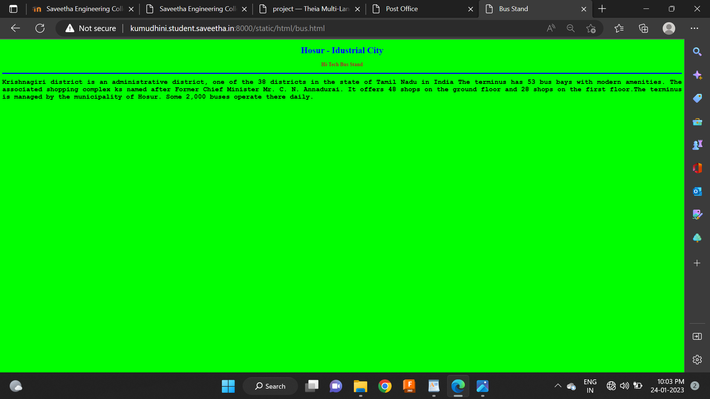
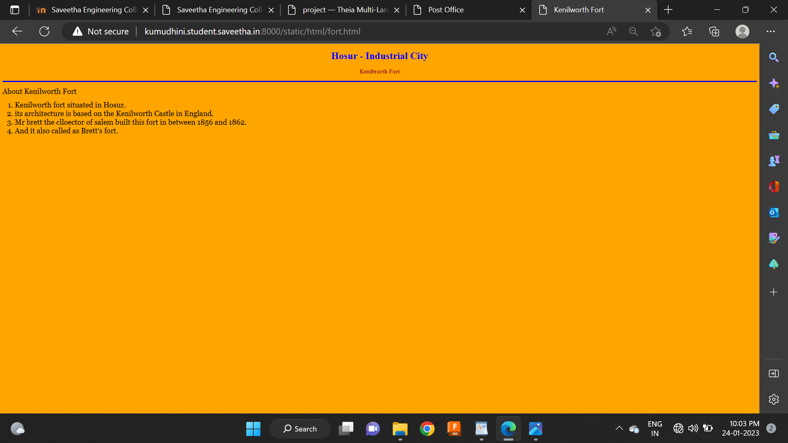
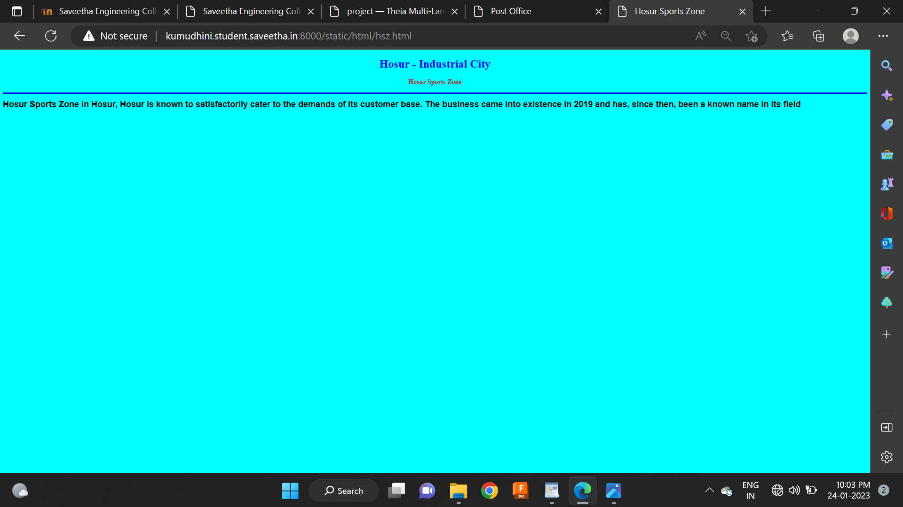
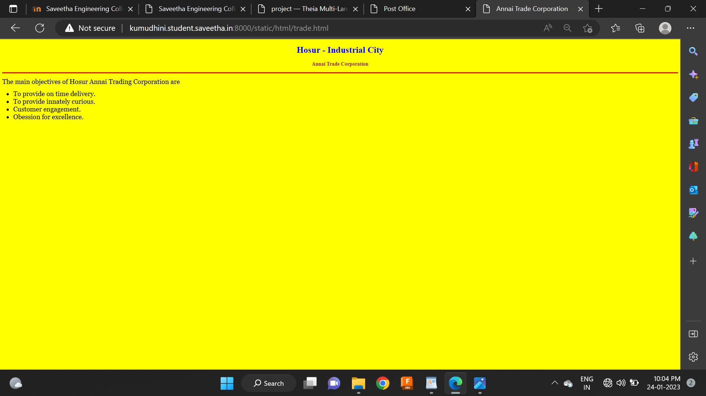
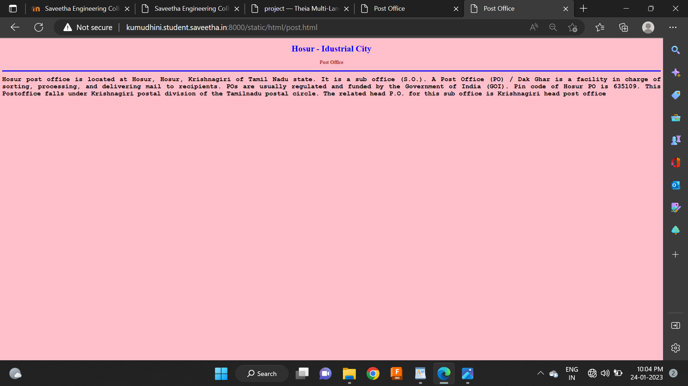
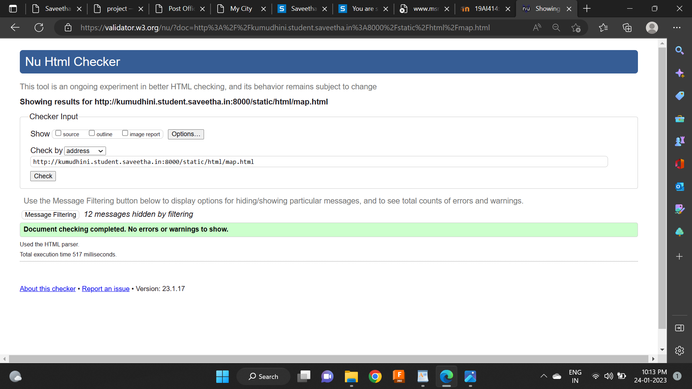

# Places Around Me
## AIM:
To develop a website to display details about the places around my house.

## Design Steps:

### Step 1:
Clone the github repository into Theia IDE.

### Step 2:
Create a new Django project

### Step 3:
Write the needed HTML code.

### Step 4:
Run the Django server and execute the HTML files.

## Code:
```
map.html
<!DOCTYPE html>
<html lang="en">
<head>
<title>My City</title>
</head>
<body>
<h1 align ="center">
<front color="blue"><b>Hosur - Industrial City</b></front>
</h1>
<h3 align ="center">
<front color="brown"><b>Kumudhini T (22002384)</b></front>
</h3>

<map name="MyCity">

<area shape="rect" coords="0,94,224,217" href="/static/html/hsz.html" title="Hosur Sports Zone">
<area shape="rect" coords="409,259,633,382" href="/static/html/trade.html" title="Annai trade corporation">
<area shape="rect" coords="33,494,202,585" href="/static/html/fort.html" title="Kenilworth Fort">
<area shape="rect" coords="792,524,1051,659" href="/static/html/bus.html" title="Hi-Tech Bus Stand">
<area shape="rect" coords="765,709,947,821"href="/static/html/post.html" title="Post Office">
</map>

</body>
</html>

bus.html
<!DOCTYPE html>
<html lang="en">
<head>
<title>Bus Stand</title>
</head>
<body bgcolor="lime">
<h1 align="center">
<font color="blue"><b>Hosur - Idustrial City</b></font>
</h1>
<h3 align="center">
<font color="brown"><b>Hi-Tech Bus Stand</b></font>
</h3>
<hr size="3" color="blue">
<p align="justify">
<font face="Courier New" size="5">
<b>
Krishnagiri district is an administrative district, one of the 38 districts in the state of Tamil Nadu in India The terminus has 53 bus bays with modern amenities. The associated shopping complex ks named after Former Chief Minister Mr. C. N. Annadurai. It offers 48 shops on the ground floor and 28 shops on the first floor.The terminus is managed by the municipality of Hosur. Some 2,000 buses operate there daily. 
</b>
</font>
</p>
</body>
</html>

post.html
<!DOCTYPE html>
<html lang="en">
<head>
<title>Post Office</title>
</head>
<body bgcolor="pink">
<h1 align="center">
<font color="blue"><b>Hosur - Idustrial City</b></font>
</h1>
<h3 align="center">
<font color="brown"><b>Post Office</b></font>
</h3>
<hr size="3" color="blue">
<p align="justify">
<font face="Courier New" size="5">
<b>
Hosur post office is located at Hosur, Hosur, Krishnagiri of Tamil Nadu state. It is a sub office (S.O.). A Post Office (PO) / Dak Ghar is a facility in charge of sorting, processing, and delivering mail to recipients. POs are usually regulated and funded by the Government of India (GOI). Pin code of Hosur PO is 635109. This Postoffice falls under Krishnagiri postal division of the Tamilnadu postal circle. The related head P.O. for this sub office is Krishnagiri head post office
</b>
</font>
</p>
</body>
</html>

hsz.html
<!DOCTYPE html>
<html lang="en">
<head>
<title>Hosur Sports Zone</title>
</head>
<body bgcolor="cyan">
<h1 align="center">
<font color="blue"><b>Hosur - Industrial City</b></font>
</h1>
<h3 align="center">
<font color="brown"><b>Hosur Sports Zone</b></font>
</h3>
<hr size="3" color="blue">
<p align="justify">
<font face="Arial" size="5">
<b>
Hosur Sports Zone in Hosur, Hosur is known to satisfactorily cater to the demands of its customer base. The business came into existence in 2019 and has, since then, been a known name in its field
</b>
</font>
</p>
</body>
</html>

trade.html
<!DOCTYPE html>
<html lang="en">
<head>
<title>Annai Trade Corporation</title>
</head>
<body bgcolor="yellow">
<h1 align="center">
<font color="blue"><b>Hosur - Industrial City</b></font>
</h1>
<h3 align="center">
<font color="brown"><b>Annai Trade Corporation</b></font>
</h3>
<hr size="3" color="red">
<p align="justify">
<font face="Georgia" size="5">
The main objectives of Hosur Annai Trading Corporation are 
<ul>
<li>To provide on time delivery.</li>
<li>To provide innately curious.</li>
<li>Customer engagement.</li>
<li>Obession for excellence.</li>
</ul>
</font>
</p>
</body>
</html>

fort.html
<!DOCTYPE html>
<html lang="en">
<head>
<title>Kenilworth Fort</title>
</head>
<body bgcolor="orange">
<h1 align="center">
<font color="blue"><b>Hosur - Industrial City</b></font>
</h1>
<h3 align="center">
<font color="brown"><b>Kenilworth Fort</b></font>
</h3>
<hr size="3" color="blue">
<p align="justify">
<font face="Georgia" size="5">
About Kenilworth Fort
<ol type="1">
<li>Kenilworth fort situated in Hosur.</li>
<li>its architecture is based on the Kenilworth Castle in England.</li>
<li>Mr brett the clloector of salem built this fort in between 1856 and 1862.</li>
<li>And it also called as Brett's fort.</li>
</ol>
</font>
</p>
</body>
</html>
```


## Output:












## HTML Validator


## Result:
The program for implementing image map is executed successfully